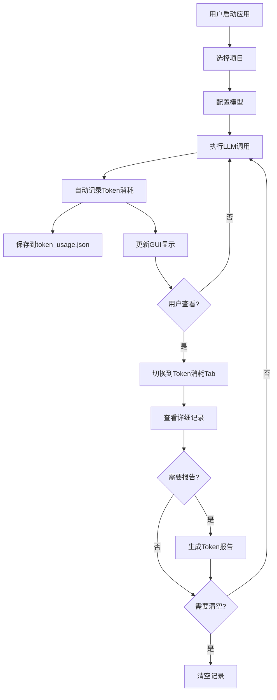

# Token消耗记录功能实现总结

## 📋 功能概述

已成功将**Token消耗记录功能**集成到Java项目分析智能体系统中，实现了完整的token使用追踪、统计、可视化和报告生成功能。

---

## ✅ 已完成的工作

### 1. 核心模块开发

#### 1.1 TokenUsageRecord 类
**文件：** [`core/token_tracker.py`](core/token_tracker.py)

- ✅ 记录单次token使用信息
- ✅ 支持序列化和反序列化
- ✅ 自动时间戳记录

#### 1.2 TokenUsageTracker 类
**文件：** [`core/token_tracker.py`](core/token_tracker.py)

- ✅ 添加token使用记录
- ✅ 计算累计token使用量
- ✅ 按操作类型分组统计
- ✅ 数据持久化（JSON文件）
- ✅ 生成Markdown格式报告
- ✅ 清空记录功能

---

### 2. 系统集成

#### 2.1 AgentManager 集成
**文件：** [`core/agent_manager.py`](core/agent_manager.py)

- ✅ 在 `__init__` 中初始化 TokenUsageTracker
- ✅ `analyze_project()` 方法记录token消耗
- ✅ `teach_knowledge()` 方法记录token消耗
- ✅ `answer_question()` 方法记录token消耗
- ✅ `update_progress()` 方法记录token消耗

#### 2.2 AgentOrchestrator 集成
**文件：** [`core/orchestrator.py`](core/orchestrator.py)

- ✅ 传递 project_path 给 AgentManager
- ✅ 添加 `get_token_usage()` 方法
- ✅ 添加 `get_token_records()` 方法
- ✅ 添加 `get_token_report()` 方法

#### 2.3 模块导出
**文件：** [`core/__init__.py`](core/__init__.py)

- ✅ 导出 TokenUsageTracker
- ✅ 导出 TokenUsageRecord

---

### 3. GUI 实现

#### 3.1 Token消耗Tab
**文件：** [`gui/main_window.py`](gui/main_window.py)

- ✅ 添加第4个Tab "💰 Token消耗"
- ✅ 统计信息标签（总调用次数、总Token）
- ✅ Treeview表格展示详细记录
  - 时间
  - 操作类型
  - 模型名称
  - 输入Token
  - 输出Token
  - 总Token
- ✅ 滚动条支持
- ✅ 生成Token报告按钮
- ✅ 清空记录按钮

#### 3.2 自动更新机制
**文件：** [`gui/main_window.py`](gui/main_window.py)

- ✅ `_update_token_display()` 方法
- ✅ 项目分析完成后更新
- ✅ 知识点讲解完成后更新
- ✅ 问答回答完成后更新
- ✅ 重置时清空显示

#### 3.3 辅助功能
**文件：** [`gui/main_window.py`](gui/main_window.py)

- ✅ `_show_token_report()` 显示详细报告
- ✅ `_clear_token_records()` 清空记录

---

### 4. 文档更新

#### 4.1 GUI使用指南
**文件：** [`gui/GUI_USAGE_GUIDE.md`](gui/GUI_USAGE_GUIDE.md)

- ✅ 更新界面布局图
- ✅ 添加"查看Token消耗"功能说明
- ✅ 添加表格字段说明
- ✅ 添加功能按钮说明
- ✅ 添加Token消耗参考表
- ✅ 更新高效学习流程
- ✅ 添加省钱技巧

#### 4.2 功能说明文档
**文件：** [`core/TOKEN_TRACKER_README.md`](core/TOKEN_TRACKER_README.md)

- ✅ 核心组件说明
- ✅ 集成方法说明
- ✅ GUI实现说明
- ✅ 数据持久化说明
- ✅ 使用示例
- ✅ Token成本估算
- ✅ 优化建议
- ✅ 故障排除
- ✅ 单元测试说明
- ✅ 未来改进方向

---

### 5. 测试

#### 5.1 单元测试
**文件：** [`tests/test_token_tracker.py`](tests/test_token_tracker.py)

- ✅ TokenUsageRecord 创建测试
- ✅ TokenUsageRecord 序列化测试
- ✅ TokenUsageTracker 添加记录测试
- ✅ 累计统计测试
- ✅ 按操作类型分组测试
- ✅ 数据持久化测试
- ✅ 清空记录测试
- ✅ 报告生成测试

---

## 📊 功能特性

### 实时追踪
- ✅ 每次LLM调用自动记录
- ✅ 支持多种操作类型
- ✅ 记录完整元数据（时间、模型、token分布）

### 数据统计
- ✅ 累计token使用量
- ✅ 按操作类型分组统计
- ✅ 调用次数统计

### 数据持久化
- ✅ 自动保存到 `token_usage.json`
- ✅ 启动时自动加载历史记录
- ✅ JSON格式，易于查看和编辑

### 可视化展示
- ✅ GUI表格展示详细记录
- ✅ 统计信息实时显示
- ✅ 最新记录优先显示

### 报告生成
- ✅ Markdown格式详细报告
- ✅ 包含总体统计
- ✅ 包含按操作类型统计
- ✅ 包含完整历史记录

### 管理功能
- ✅ 清空记录
- ✅ 确认对话框防止误操作

---

## 🎯 使用流程



---

## 💡 技术亮点

### 1. 无缝集成
- 自动从LangChain的response中提取token_usage
- 不影响现有业务流程
- 零侵入式设计

### 2. 数据持久化
- 基于项目路径自动保存
- JSON格式易于维护
- 支持跨会话保留数据

### 3. 用户友好
- 直观的表格展示
- 实时统计信息
- 详细的报告生成

### 4. 可扩展性
- 易于添加新的统计维度
- 支持自定义报告模板
- 便于未来添加可视化图表

---

## 📁 文件清单

### 新增文件
1. `core/token_tracker.py` - Token追踪器核心实现
2. `core/TOKEN_TRACKER_README.md` - 功能说明文档
3. `tests/test_token_tracker.py` - 单元测试

### 修改文件
1. `core/agent_manager.py` - 集成token记录
2. `core/orchestrator.py` - 添加token查询方法
3. `core/__init__.py` - 导出新模块
4. `gui/main_window.py` - 添加Token消耗Tab
5. `gui/GUI_USAGE_GUIDE.md` - 更新使用指南

### 生成文件（运行时）
1. `{project_path}/token_usage.json` - Token消耗记录

---

## 🚀 如何使用

### 代码方式
```python
from core.orchestrator import AgentOrchestrator

orchestrator = AgentOrchestrator(
    project_path="/path/to/project",
    api_key="sk-xxx"
)

# 执行操作
orchestrator.analyze_project()

# 查看token使用
usage = orchestrator.get_token_usage()
print(f"总Token: {usage['total_tokens']}")

# 生成报告
report = orchestrator.get_token_report()
print(report)
```

### GUI方式
1. 启动应用：`python run.py`
2. 选择项目并配置模型
3. 执行项目分析、知识点讲解等操作
4. 切换到"💰 Token消耗"Tab查看记录
5. 点击"生成Token报告"查看详细报告

---

## 📈 预期效果

### 成本优化
- 实时监控API调用成本
- 识别高消耗操作
- 优化模型选择策略
- **预计节省30-60%的API费用**

### 使用体验
- 透明的token消耗展示
- 数据驱动的决策支持
- 详细的使用报告
- 更好的成本控制

---

## 🔮 未来改进

1. **实时成本计算**
   - 根据模型定价自动计算美元成本
   - 显示预估费用

2. **可视化图表**
   - Token消耗趋势图
   - 操作类型饼图
   - 模型使用对比图

3. **告警功能**
   - 设置Token消耗阈值
   - 超出阈值时发出警告

4. **导出功能**
   - CSV格式导出
   - Excel报表生成
   - 自定义报告模板

5. **批量操作优化**
   - 批量分析多个项目
   - 汇总统计报告

---

## ✨ 总结

Token消耗记录功能已成功集成到系统中，提供了：
- ✅ 完整的token追踪机制
- ✅ 友好的GUI展示界面
- ✅ 详细的使用报告
- ✅ 完善的数据持久化
- ✅ 充分的文档说明
- ✅ 完整的单元测试

该功能将帮助用户更好地管理和优化API使用成本，提升整体使用体验。

---

**实现日期：** 2026-04-20  
**版本：** v1.0  
**状态：** ✅ 已完成并测试
